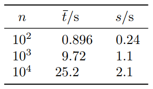

*La version fran&ccedil;aise suit.*

## Overview

This package implements and improves the Hyndman&ndash;Khandakar algorithm for the automatic selection of autoregressive integrated moving average (ARIMA) models for time series analysis and forecasting. It is a wrapper around the [StatsModels](https://github.com/statsmodels/statsmodels) package.

The original algorithm uses only the Kwiatkowski&ndash;Phillips&ndash;Schmidt&ndash;Shin (KPSS) test to determine the degree of differencing. This package also incorporates the augmented Dicker&ndash;Fuller (ADF) test. This distinction is key. The KPSS test evaluates the null hypothesis that the time series is stationary around a deterministic trend against the alternative of a unit root. On the other hand, the ADF test evaluates the null hypothesis that the time series contains a unit root against the alternative of stationarity. These tests are complementary, and the idea behind this implementation is that the inclusion of the ADF test makes the process of finding the degree of differencing more robust.

## Dependencies

- NumPy
- Pandas
- StatsModels

## Usage

The `hyndman_khandakar` module contains a single class, `HyndmanKhandakar`. This class may be initialized with the following parameters:
- `ts`, required &ndash; the (datetime-indexed) time series;
- `alpha`, optional &ndash; the Type I error rate for the ADF and KPSS tests (default: `0.05`);
- `conditions`, optional &ndash; the upper bound (inclusive) for each of *p* and *q* as well as the lower bound (exclusive) for the roots of the AR and MA polynomials (default: `(5, 1.001)`);
- `full_search`, optional &ndash; whether to traverse all possible combinations of *p* and *q* (for a given *d*) up to the upper bound specified in `conditions` (default: `False`); and
- `verbose`, optional &ndash; whether to display warnings and fitting details (default: `0`).

Executing the single `find()` method will initiate a search of the model space (or a subset thereof) and store the model object (`model`), order and trend (`order`), Akaike information criterion with correction (AICc) for small sample sizes (`aicc`), and the *p*-values for the ADF and KPSS tests (`p_values`) in the class instance. Additional information, such as the parameters, can be accessed through the `model` attribute. Moreover, when calling `find()`, you may pass keyword arguments to be propagated to the `statsmodels.tsa.arima_model.ARIMA.fit()` method.

For an example of usage, see *tests/test_hyndman_khandakar.py*.

## Time Complexity

For fun, I measured the time complexity of the algorithm, including StatsModels's fitting procedure. I generated time series of different lengths *n* using an ARIMA(2, 0, 1) model and timed the algorithm for 3 runs of 3 loops for each choice of *n* using Python's `timeit` module. The measured time complexity is approximately *O* (log *n*):

  

However, the ability of the algorithm to scale is not critical for the following reasons:
- For many time series, especially those with larger, e.g., monthly, frequencies, there aren't many data; and
- even when there are many data, not all of those data may be relevant to the analysis, particularly the older data.

The details of my machine are as follows:

- Debian GNU/Linux 10.4 OS
- 4.19.0-9-amd64 kernel
- Intel® Core™ i5-8250U CPU @ 1.60 GHz
- 7.7 GiB of RAM

## Limitations

This package does not presently support seasonal models.

***

## Vue d'ensemble

Ce paquet logiciel met en pratique et am&eacute;liore l'algorithme de Hyndman-Khandakar pour la s&eacute;lection automatique des mod&egrave;les autor&eacute;gressifs &agrave; moyennes mobiles int&eacute;gr&eacute;s (ARMMI) pour l'analyse des s&eacute;ries temporelles et la pr&eacute;vision. Il encapsule le paquet logiciel [StatsModels](https://github.com/statsmodels/statsmodels).

L'algorithme original utilise seulement le test de Kwiatkowski-Phillips-Schmidt-Shin (KPSS) pour trouver l'ordre de diff&eacute;renciation. Ce paquet logiciel incorpore aussi le test augment&eacute; de Dickey-Fuller (ADF). Ce distinction est crucial. Le test de KPSS &eacute;value l'hypoth&egrave;se nulle que la s&eacute;rie temporelle est stationnaire environ une tendance d&eacute;terministe contre l'alternative de la pr&eacute;sence d'une racine unitaire. D'autre part, le test ADF &eacute;value l'hypoth&egrave;se nulle que la s&eacute;rie temporelle contient une racine unitaire contre l'alternative d'un processus stationnaire. Ces tests sont compl&eacute;mentaires et l'id&eacute;e derri&egrave;re cette mise en &oelig;uvre est que l'inclusion du test ADF rend plus solide la d&eacute;termination de l'ordre de diff&eacute;renciation.

## D&eacute;pendances

- NumPy
- Pandas
- StatsModels

## Utilisation

Le module `hyndman_khandakar` contient une seule classe, `HyndmanKhandakar`, qu'on peut initialiser avec les param&egrave;tres suivants :
- `ts`, requis &ndash; la s&eacute;rie temporelle (index&eacute;e avec la date et l'heure) ;
- `alpha`, optionnel &ndash; le taux des erreurs du 1er type pour le test ADF et le test de KPSS (valeur par d&eacute;faut : `0.05`) ;
- `conditions`, optionnel &ndash; le majorant (inclus) pour *p* et *q* ainsi que le minorant (exclusif) pour les racines des fonctions polynomiales AR et MM (valeur par d&eacute;faut : `(5, 1.001)`) ;
- `full_search`, optionnel &ndash; si parcourir tous les combinaisons possibles de *p* et *q* (avec *d* fixe) allant jusqu'au majorant sp&eacute;cifi&eacute; par le param&egrave;tre `conditions` (valeur par d&eacute;faut : `False`) ; et
- `verbose`, optionnel &ndash; si afficher des alertes et des d&eacute;tails de la proc&eacute;dure d'ajustement (valeur par d&eacute;faut : `0`).

L'ex&eacute;cution de la seule m&eacute;thode, `find()`, initierait des recherches de l'espace des mod&egrave;les ou un sous-ensemble de celui-ci et entreposerait l'objet de mod&egrave;le (`model`), l'ordre et la tendance (`order`), le crit&egrave;re d'information d'Akaike corrig&eacute; (`aicc`) pour les &eacute;chantillons petits et les valeurs-*p* des tests (`p_values`) dans l'instance de la classe. On peut acc&eacute;der aux informations suppl&eacute;mentaires comme les coefficients du mod&egrave;le par l'attribut `model`. De plus, on peut passer des arguments &agrave; la m&eacute;thode `find()`, qui seraient propag&eacute;s &agrave; la m&eacute;thode `statsmodels.tsa.arima_model.ARIMA.fit()`.

Voyez le fichier *tests/test_hyndman_khandakar.py* pour un exemple de l'utilisation.

## Complexit&eacute; temporelle

Comme &ccedil;a, j'ai mesur&eacute; la complexit&eacute; temporelle de cet algorithme, y compris la proc&eacute;dure d'ajustement de StatsModels. J'ai g&eacute;n&eacute;r&eacute; des s&eacute;ries temporelles des longeurs diff&eacute;rentes *n* avec un mod&egrave;le ARMMI(2, 0, 1) et j'ai chronom&eacute;tr&eacute; l'algorithme pour 3 essais de 3 boucles pour chaque choix de *n* avec le module `timeit` de Python. La complexit&eacute; temporelle mesur&eacute; est &agrave; peu pr&egrave;s *O* (log *n*) :

  

Cependant, la capacit&eacute; de l'algorithme &agrave; se r&eacute;duire n'est pas essentiel pour ces raisons :
- Pour beaucoup des s&eacute;ries temporelles, particuli&egrave;rement celles-ci qui ont une fr&eacute;quence plus grande, p. ex. mensuelle, il n'y a pas beaucoup des donn&eacute;es ; et
- m&ecirc;me qu'il'y a beaucoup des donn&eacute;es, certaines n'auraient pas &agrave; voir avec l'analyse, en particulier les plus vieilles.

Les sp&eacute;cifications de ma machine suivent :
- OS Debian GNU/Linux 10,4
- Noyau 4,19,0-9-amd64
- UCT Intel® Core™ i5-8250U @ 1,60 GHz
- 7,7 Gio de RAM

## Limites

Ce paquet logiciel ne supporte pas maintenant des mod&egrave;les saisonni&egrave;res.

***

## Bibliography/Bibliographie

R. J. Hyndman and Y. Khandakar, "Automatic Time Series Forecasting: The forecast Package for **R**," *J. Stat. Software*, vol. 27, no. 3, Jul. 2008. Available doi: 10.18637/jss.v027.i03
